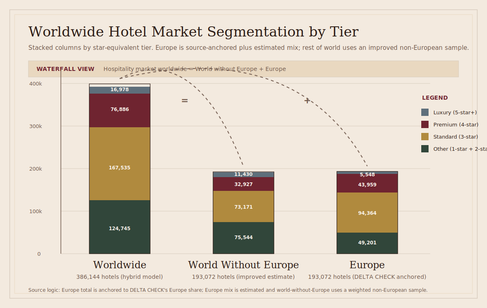

# Hotel Market Segmentation by Tier

## Scope

This note segments the worldwide hotel market by the tier logic we want to use in the pitch:

- `Luxury` = German `5-star` or similar and above
- `Premium` = German `4-star` or similar
- `Standard` = German `3-star` or similar
- `Other` = below German `2-star` or similar

Important limitation:

- The most defensible globally comparable dataset I found is for `star-rated hotels`.
- Because of that, this note should be read as a segmentation of the `star-comparable hotel property market`.
- It does **not** fully capture the entire global universe of unrated inns, guesthouses, or informal accommodation.

For the pitch, this is still useful because your tier framework is itself based on `stars or similar`.

## Best Working Sources

### 1. Global anchor

DELTA CHECK says there are:

- `386,144` star-rated hotel properties worldwide
- representing `17.6%` of the global hotel market

Source:

- [DELTA CHECK: All star-rated hotels counted worldwide](https://www.delta-check.com/en/all-star-rated-hotels-worldwide-counted-first-time-ever/)

### 2. Europe anchor

The most precise star-by-star property count I found is a `European Union` breakdown from DELTA CHECK:

- `5-star`: `4,606`
- `4-star`: `36,498`
- `3-star`: `78,348`
- `2-star`: `30,753`
- `1-star`: `10,097`
- `Total`: `160,303`

Source:

- [DELTA CHECK: Sterne Hotels in der EU](http://www.delta-check.com/de/aktuelle-statistik_sterne-hotels-in-der-eu/)

### 3. Geographic Europe anchor

DELTA CHECK also states that `Europe` accounts for `50%` of all star-rated hotels globally.

That implies:

- `193,072` star-rated hotel properties in geographic Europe

Calculation:

- `386,144 x 50% = 193,072`

Important:

- I did **not** find a publicly surfaced exact `geographic Europe` star-by-star breakdown.
- So the `geographic Europe` segment split below is an `estimate`.
- It uses the exact `EU star mix` as a proxy for `geographic Europe`.
- For `rest of world`, I now use a better estimate based on confirmed non-European DELTA CHECK country pages instead of reusing the EU mix.

## Segmentation Output

## Visual Summary

This chart combines:

- a `stacked column` view by star-equivalent segment
- a `waterfall-style comparison` showing that `Worldwide = World without Europe + Europe`

Column logic:

- Left: `Hospitality market worldwide` (`hybrid model`)
- Middle: `World without Europe` (`improved estimate`)
- Right: `Europe` (`best-effort estimate`, anchored to DELTA CHECK's Europe share)

Legend:

- `Luxury` = `5-star+`
- `Premium` = `4-star`
- `Standard` = `3-star`
- `Other` = `1-star + 2-star`

## Rest of World: Improved Estimate

To improve the `rest of world` split, I replaced the earlier `EU-proxy` approach with a weighted non-European sample built from DELTA CHECK country-level pages.

Countries used:

- `United States`
- `China`
- `India`
- `Japan`
- `Mexico`
- `Indonesia`
- `United Arab Emirates`
- `Australia`
- `Saudi Arabia`
- `Singapore`
- `Malaysia`
- `Philippines`
- `South Africa`

Combined star-rated sample size:

- `127,652` star-rated hotel properties

This gives the following `rest of world` estimate:

| Segment | Mapping | Hotel properties | Status |
| --- | --- | ---: | --- |
| Luxury | `5-star+` | `~11,430` | Improved estimate |
| Premium | `4-star` | `~32,927` | Improved estimate |
| Standard | `3-star` | `~73,171` | Improved estimate |
| Other | `1-star + 2-star` | `~75,544` | Improved estimate |
| Total | `1-star to 5-star+` | `193,072` | Source-backed total, estimated split |

### How the improved rest-of-world numbers were built

- Keep the source-backed total:
  - `World without Europe = 386,144 - 193,072 = 193,072`
- Build a weighted star mix from the confirmed non-European country pages listed above
- Apply that mix to the `193,072` rest-of-world total

This is better than the earlier EU-proxy method because it reflects the star structure of large non-European markets directly.

## Worldwide Star-Comparable Hotel Market

| Segment | Mapping | Hotel properties | Status |
| --- | --- | ---: | --- |
| Luxury | `5-star+` | `~16,978` | Hybrid model |
| Premium | `4-star` | `~76,886` | Hybrid model |
| Standard | `3-star` | `~167,535` | Hybrid model |
| Other | `1-star + 2-star` | `~124,745` | Hybrid model |
| Total | `1-star to 5-star+` | `386,144` | Source-backed total |

### How the worldwide numbers were built

- `Worldwide total` remains source-backed:
  - `386,144` star-rated hotel properties worldwide
- `Europe` uses the best-effort Europe estimate shown below
- `World without Europe` uses the improved non-European sample mix shown above
- `Worldwide segment values` are the sum of `Europe + World without Europe`

Note:

- DELTA CHECK's global headline figures still say:
  - `5-star` hotels are `nearly 20,000`
  - `3-star` hotels are `45%` of the global star-rated market
- The hybrid model lands close to those anchors, but not exactly on them, because it is built bottom-up from the improved regional mix.

## Europe

Because you asked for Europe to be as precise as possible, I am showing `2` views:

1. `EU exact counts` from DELTA CHECK
2. `Geographic Europe estimate` derived from DELTA CHECK's statement that Europe is `50%` of global star-rated hotels

## Europe: EU Exact Counts

| Segment | Mapping | Hotel properties | Status |
| --- | --- | ---: | --- |
| Luxury | `5-star+` | `4,606` | Exact source-based |
| Premium | `4-star` | `36,498` | Exact source-based |
| Standard | `3-star` | `78,348` | Exact source-based |
| Other | `1-star + 2-star` | `40,850` | Exact source-based |
| Total | `1-star to 5-star+` | `160,303` | Exact source-based |

## Europe: Geographic Europe Best-Effort Estimate

| Segment | Mapping | Hotel properties | Status |
| --- | --- | ---: | --- |
| Luxury | `5-star+` | `~5,548` | Estimated |
| Premium | `4-star` | `~43,959` | Estimated |
| Standard | `3-star` | `~94,364` | Estimated |
| Other | `1-star + 2-star` | `~49,201` | Estimated |
| Total | `1-star to 5-star+` | `193,072` | Source-backed total, estimated segment split |

Source label for the `Europe` chart column:

- `Europe (best-effort estimate; total anchored to DELTA CHECK Europe = 50% of global star-rated hotels)`

### How the geographic Europe estimate was built

Step 1:

- Use DELTA CHECK's statement that `Europe = 50%` of all global star-rated hotels.

Step 2:

- Compute total Europe star-rated hotel properties:
  - `386,144 x 50% = 193,072`

Step 3:

- Apply the exact `EU star mix` to that Europe total.

This is the most defensible current shortcut unless we find a public star-by-star count covering full geographic Europe directly.

Source label for the `World without Europe` chart column:

- `World without Europe = improved estimate`
- The total is calculated as `Worldwide total - Europe estimate`
- The segment split is estimated from a weighted sample of major non-European DELTA CHECK country pages

## Key Takeaways for the Pitch

- The largest star-comparable segment is clearly `Standard (3-star)`.
- The `Premium + Luxury` opportunity is still large enough to matter:
  - Worldwide: about `93,864` hotels in the hybrid model
  - Geographic Europe estimate: about `49,507` hotels
- Europe matters disproportionately for this project because:
  - it has a very large star-rated hotel base
  - it contains a dense concentration of historic, story-rich hotel properties
  - the user persona and brand storytelling angle fit especially well with European premium and luxury hospitality

## Recommended Pitch Framing

For the deck, I would recommend saying:

> We are initially targeting the premium and luxury hotel segment: roughly `94k` star-comparable hotel properties worldwide in the current hybrid model, including about `50k` in geographic Europe on our current best estimate.

If you want a more conservative phrasing:

> Even using a narrow star-based segmentation, Europe alone contains roughly `41k` premium and luxury hotels on an EU exact basis, and about `50k` on a geographic Europe estimate.

## Open Follow-Up

If we want to make this even stronger, the next research pass should do one of these:

1. Build a `country-by-country Europe` table for major non-EU countries like the `UK`, `Switzerland`, `Norway`, `Iceland`, and the Balkans.
2. Build a second model for the `full hotel universe`, including `unrated but premium/luxury-like` properties.
3. Add `rooms` and `estimated annual guest volume` by segment, not just property counts.

## Sources and Methods Appendix

This section separates `directly sourced` numbers from `derived` and `modeled` numbers.

### Directly sourced global anchors

- `386,144` star-rated hotel properties worldwide
- `17.6%` of the global hotel market
- `Europe = 50%` of worldwide star-rated hotels
- `3-star = 45%` of worldwide star-rated hotels
- `5-star = nearly 20,000` worldwide

Source:

- [DELTA CHECK: All star-rated hotels counted worldwide](https://www.delta-check.com/en/all-star-rated-hotels-worldwide-counted-first-time-ever/)

### Directly sourced EU aggregate used as Europe proxy

Current EU aggregate used in this note:

- `5-star`: `4,606`
- `4-star`: `36,498`
- `3-star`: `78,348`
- `2-star`: `30,753`
- `1-star`: `10,097`
- `Total`: `160,303`

Source:

- [DELTA CHECK: Sterne Hotels in der EU](http://www.delta-check.com/de/aktuelle-statistik_sterne-hotels-in-der-eu/)

Important caveat:

- The `EU 4-star / 2-star assignment` is currently under review.
- The total is usable.
- The exact `Premium / Other` split should be treated as `provisional` until confirmed against the original source table or a second independent source.

### Country-level DELTA CHECK pages used for the improved `rest of world` estimate

- United States: [DELTA CHECK US](https://www.delta-check.com/en/hoteldata-reference-hotel-database-united-states/)
- China: [DELTA CHECK China](https://www.delta-check.com/en/hoteldata-reference-hotel-database-china/)
- India: [DELTA CHECK India](https://www.delta-check.com/en/hoteldata-reference-hotel-database-india/)
- Japan: [DELTA CHECK Japan](https://www.delta-check.com/en/hoteldata-reference-hotel-database-japan/)
- Mexico: [DELTA CHECK Mexico](https://www.delta-check.com/en/hoteldata-reference-hotel-database-mexico/)
- Indonesia: [DELTA CHECK Indonesia](https://www.delta-check.com/en/hoteldata-reference-hotel-database-indonesia/)
- United Arab Emirates: [DELTA CHECK UAE](https://www.delta-check.com/en/hoteldata-reference-hotel-database-united-arab-emirates/)
- Australia: [DELTA CHECK Australia](https://www.delta-check.com/en/hoteldata-reference-hotel-database-australia/)
- Saudi Arabia: [DELTA CHECK Saudi Arabia](https://www.delta-check.com/en/hoteldata-reference-hotel-database-saudi-arabia/)
- Singapore: [DELTA CHECK Singapore](https://www.delta-check.com/en/hoteldata-reference-hotel-database-singapore/)
- Malaysia: [DELTA CHECK Malaysia](https://www.delta-check.com/en/hoteldata-reference-hotel-database-malaysia/)
- Philippines: [DELTA CHECK Philippines](https://www.delta-check.com/en/hoteldata-reference-hotel-database-philippines/)
- South Africa: [DELTA CHECK South Africa](https://www.delta-check.com/en/hoteldata-reference-hotel-database-south-africa/)

### Derived figures and formulas

#### Geographic Europe total

- `193,072`

Formula:

- `386,144 x 50% = 193,072`

Source chain:

- worldwide total + Europe share from [DELTA CHECK: All star-rated hotels counted worldwide](https://www.delta-check.com/en/all-star-rated-hotels-worldwide-counted-first-time-ever/)

Status:

- `source-backed total`

#### Geographic Europe segment split

Current note uses:

- `Luxury`: `~5,548`
- `Premium`: `~43,959`
- `Standard`: `~94,364`
- `Other`: `~49,201`

Source chain:

- Europe total from the global DELTA CHECK page
- segment mix from `Sterne Hotels in der EU`

Status:

- `best-effort estimate`
- `Premium / Other split provisional pending EU star-order confirmation`

#### Rest of world total

- `193,072`

Formula:

- `386,144 - 193,072 = 193,072`

Source chain:

- global DELTA CHECK total
- Europe share from DELTA CHECK global headline

Status:

- `source-backed total`

#### Rest of world segment split

Current note uses:

- `Luxury`: `~11,430`
- `Premium`: `~32,927`
- `Standard`: `~73,171`
- `Other`: `~75,544`

Source chain:

- `rest of world total` from the DELTA CHECK global anchor
- weighted star mix from the DELTA CHECK country pages listed above

Status:

- `improved estimate`

#### Worldwide hybrid model

Current note uses:

- `Luxury`: `~16,978`
- `Premium`: `~76,886`
- `Standard`: `~167,535`
- `Other`: `~124,745`

Formula:

- `Worldwide hybrid = Europe estimate + rest of world estimate`

Source chain:

- Europe estimate
- rest of world estimate

Status:

- `hybrid model`, not directly source-reported

### Recommended source labels for the pitch

If these numbers are reused in slides, use these labels:

- `Source: DELTA CHECK` for direct global anchors
- `Estimate based on DELTA CHECK` for Europe and rest-of-world segment splits
- `Hybrid model based on DELTA CHECK` for worldwide segment totals

### Executive caution

The strongest figures in this note are:

- `386,144` worldwide star-rated hotels
- `Europe = 50%` of global star-rated hotels
- the country-level DELTA CHECK counts used in the non-European sample

The least secure figures are:

- the current `EU 4-star / 2-star` assignment
- any `Premium / Other` number that depends directly on that EU split
